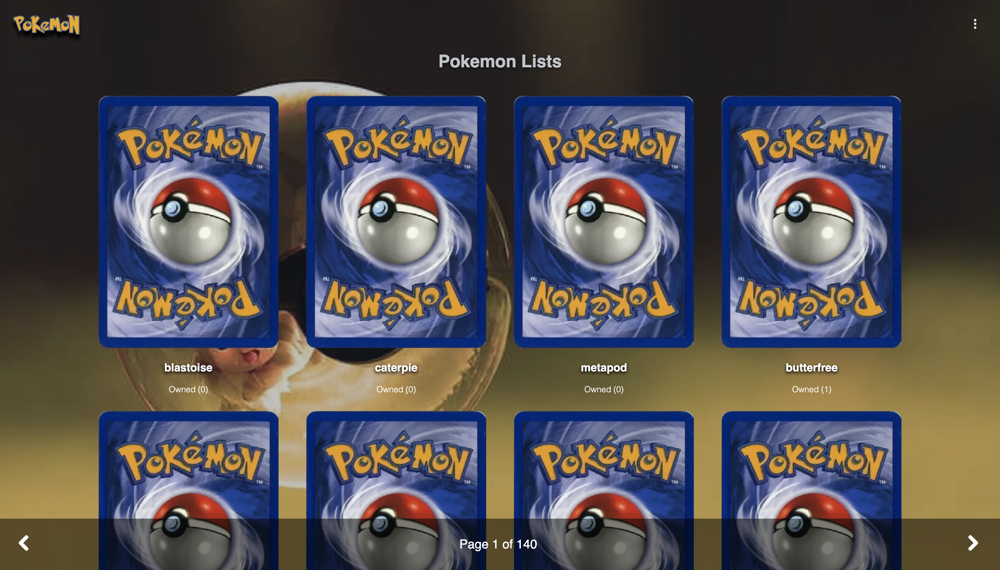
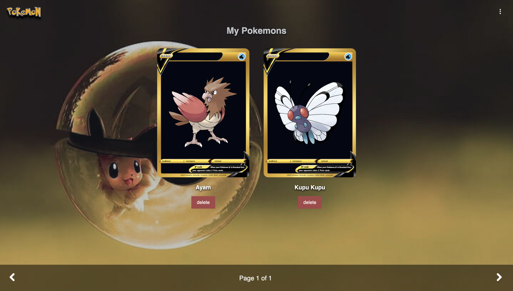
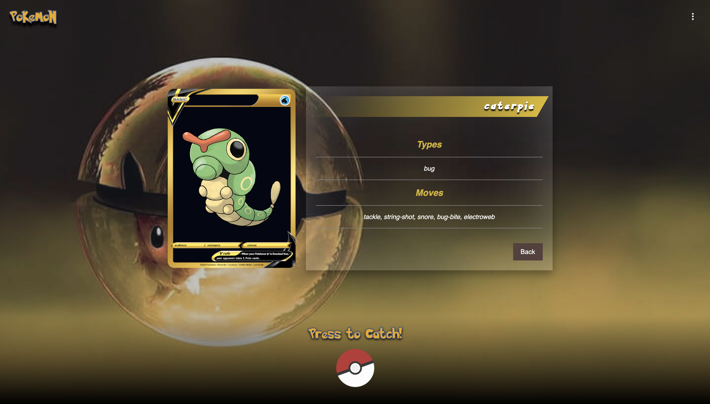
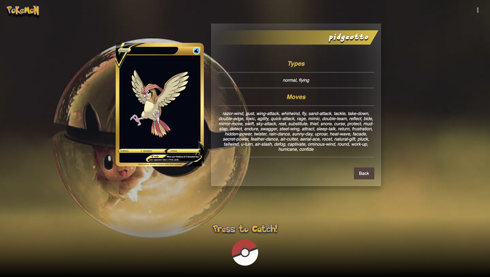
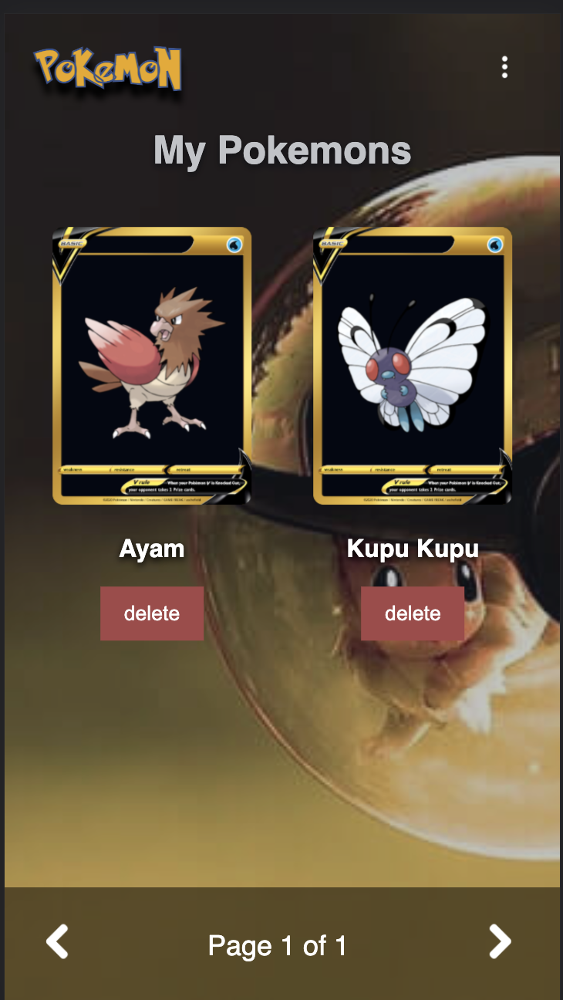
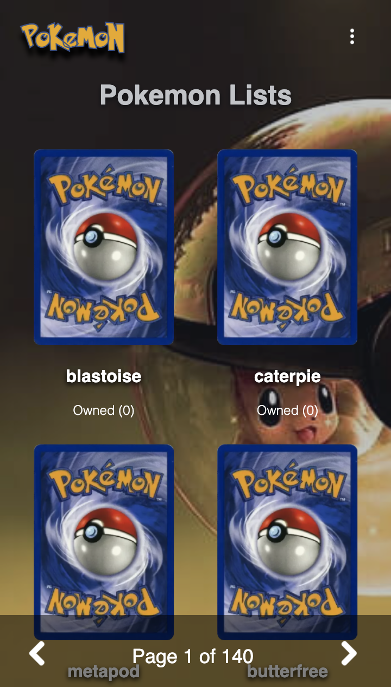

# GET Pokemon + Catch Reactjs (Poke API)

Catch API and get total Owned

## Getting started
### Installation

### Requirements (Run On localhost)

- json-server  
Globally via npm
```
npm install -g json-server
```

- http-server 

Globaly via Homebrew
```
brew install http-server
```

Globally via npm
```
npm install --global http-server
```


copy `.env-example` and rename to `.env` 

```

POKEAPI_URL = 'https://pokeapi.co/api/v2'
JSON_SERVER = 'http://localhost:5000'

```

Install dependency
```
npm install

```

Run Development

```
npm run dev
```

Run Production (Localhost)
```
npm run build
```
```
npm run prod
```

### Screenshoot








### Demo 

[Demo](https://pokemon-catch-ginanjardp.web.app)

### Thank You 


GinanjarDP
[Linkeddin](https://id.linkedin.com/in/ginanjar-putranto-0416a913b)